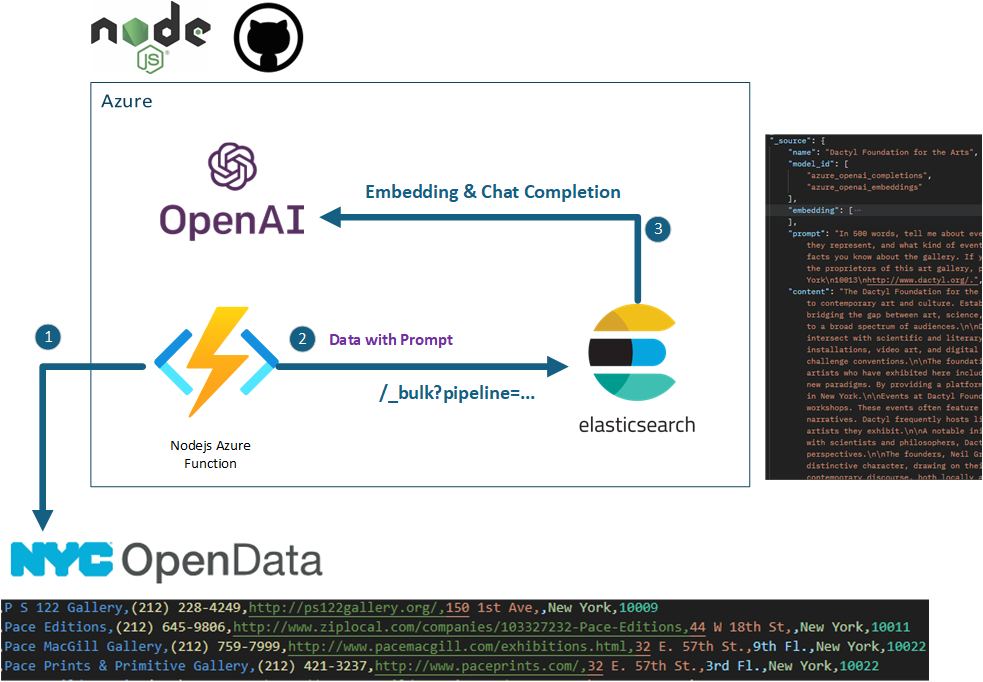
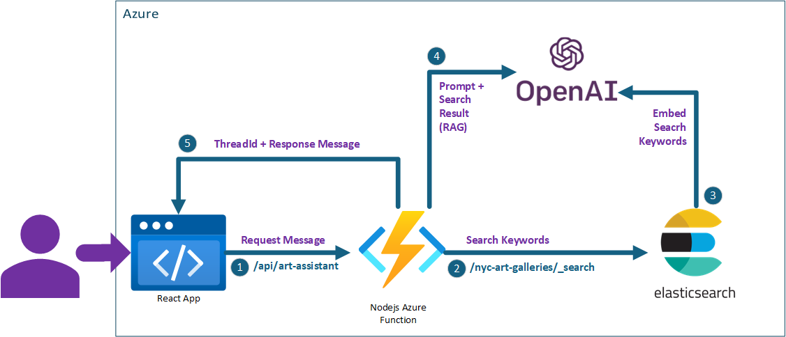

# NYC Art Gallery Chatbot with Azure OpenAI and Elasticsearch

See the live demo at [https://art.richtercloud.com](https://art.richtercloud.com/)

This repository contains the code and documentation for a conversational chatbot designed to help users explore art galleries in New York City. Built with a combination of **Azure OpenAI**, **Elasticsearch**, **Node.js**, and **React**, this solution demonstrates how to leverage Elasticsearch's AI integration capabilities to create a rich, interactive user experience. The chatbot can answer questions about galleries, provide descriptions, and surface relevant gallery information using both semantic search and natural language generation.

### Solution Overview

This project utilizes **Retrieval-Augmented Generation (RAG)**, a method that combines retrieval-based search with AI-driven response generation. The RAG pattern is ideal for applications like this one, where structured data (e.g., gallery descriptions and details) needs to be dynamically enhanced and presented in response to user queries. Key components of this solution include:

1. **Data Enrichment and Indexing (ETL Process)**:
   - To prepare the NYC art gallery dataset, we leverage a custom ETL pipeline that uses **Elasticsearch’s Bulk API** for efficient data loading, **Inferencing Processors** for AI enrichment, and **Pipelines** for streamlined processing. This pipeline enriches gallery records with Azure OpenAI-powered text generation and embeddings, enabling semantic search capabilities.

2. **User Interaction and AI-Powered Response (APP Process)**:
   - On the application side, a React-based chatbot interface interacts with a Node.js Azure Function backend, which orchestrates calls between **Elasticsearch** and **Azure OpenAI’s Assistants API**. The app performs searches, retrieves relevant data, and generates conversational responses, giving users an intuitive way to discover art galleries.

By combining Elasticsearch’s robust search and AI enrichment features with Azure OpenAI’s natural language capabilities, this chatbot solution showcases how to quickly add intelligent search and conversational functionality to your data. It provides a strong foundation for building advanced AI applications that leverage the power of cloud-hosted search and language models.

## ETL Process

1. **Data Ingestion (NYC OpenData to Azure Function)**:
   - The process starts by pulling [art gallery data from NYC OpenData](https://data.cityofnewyork.us/Recreation/New-York-City-Art-Galleries/tgyc-r5jh), which contains details about various galleries in New York City. This data is sent to a Node.js Azure Function for initial preprocessing and formatting to prepare it for embedding and indexing. Part of the preprocessing is to add a `"prompt"` field to the data that Elasticsearch will use to generate a summary of gallery Gallery when it's record is indexed. See `elastic-config.js` [line 46](api/src/elastic-config.js#L46).

2. **Bulk Data Indexing (Elasticsearch Bulk API)**:
   - The Azure Function uses Elasticsearch's **Bulk API** to efficiently index hundreds of art gallery records at once. This API allows for large-scale data uploads in a single operation, reducing the time and resources required for indexing. This approach is ideal for handling high volumes of data quickly, making it easy to prepare the dataset for AI-driven search. See `elastic-config.js` [line 77](api/src/elastic-config.js#L77).

3. **Inference Processors for AI Enrichment**:
   - As part of the bulk import, Elasticsearch’s **Inferencing Processors** are used to automatically enhance each record with AI-driven insights. 
      - First, a **chat completion** is generated on the `"prompt"` field using Azure OpenAI. This generates a natural language summary or relevant completion, which is then stored in the `"content"` field.
      - Next, the **embedding** of the `"content"` field is created using Azure OpenAI, and this vector representation is stored in the `"embedding"` field. These embeddings capture the semantic meaning of each gallery’s information, enabling more accurate and nuanced search capabilities.
      - See `elastic-config.js` [line 130](api/src/elastic-config.js#L130) and [line 151](api/src/elastic-config.js#L151) to see how the processors are created.
   - To streamline this entire process, a dedicated **Pipeline** in Elasticsearch is configured for the bulk import. This pipeline coordinates the Inferencing Processors to apply chat completions and embeddings automatically as data is ingested, enabling seamless enrichment of each record. This automated approach significantly speeds up data processing and ensures consistency across records. See `elastic-config.js` [line 160](api/src/elastic-config.js#L160) to see how the pipeline is created.

This ETL pipeline leverages Elasticsearch's native AI capabilities and enables you to add powerful search and inferencing features to your records. By using these Elasticsearch features, you can efficiently integrate AI and add semantic search capabilities to the art gallery dataset, maximizing the value of your Azure OpenAI investment. This allows you to quickly build a smart, AI-enhanced search experience for users.

## Bot App Flow

1. **User Message Request (React App to Azure Function)**:
   - The user interacts with the chat interface in the React application, which is hosted on [Azure Static Web Apps](https://learn.microsoft.com/en-us/azure/static-web-apps/overview). The user submits a message (query) through the chat interface, and this message is sent as a request to the backend endpoint `/api/art-assistant` (see `ActionProvider.jsx` [line 52](/src/chatbot/ActionProvider.jsx#L52)), handled by the Node.js Azure Function. The Chat Bot functionality is provided by a React library called [react-chatbot-kit](https://fredrikoseberg.github.io/react-chatbot-kit-docs/).

2. **Search Request to Elasticsearch (Azure Function to Elasticsearch)**:
   - The Node.js Azure Function receives the user's message and uses the tool calling capability of the [OpenAI Assistants API](https://platform.openai.com/docs/assistants/overview) to extract relevant search keywords and send a search request to the Elasticsearch index at `/nyc-art-galleries/_search`. See `assistant.js` [line 117](api/src/assistant.js#L117). This call helps retrieve relevant data from the art gallery index based on the user's query.

3. **Embedding Search Keywords (Elasticsearch)**:
   - Within Elasticsearch, the search keywords are embedded, enabling a vector-based similarity search. This vector search is more effective in retrieving semantically relevant results than traditional keyword matching, allowing Elasticsearch to find relevant gallery information closely aligned with the user's question. To learn more, see `elastic-config.js` [line 193](api/src/elastic-config.js#L193).

4. **Constructing the Response (OpenAI Assistants API)**:
   - The Elasticsearch results, combined with the initial user prompt, are then passed to Azure OpenAI's Assistants API by the Azure Function. This API uses the information to generate a conversational response. The Assistants API creates a response by embedding the Assistant's instructions, the user’s message and the search results, constructing a coherent answer.

5. **Response Back to User (Azure Function to React App)**:
   - The response from the Azure OpenAI, along with the conversation’s `ThreadId` and response message, is streamed by the Node.js Azure Function to the React application (see `assistant.js` [line 79](api/src/assistant.js#L79)). The chat interface then displays the streaming response to the user, allowing the conversation to continue in a thread. **Note** that OpenAI returns markdown to the user but when the message is finished streaming the bot converts the markdown into HTML using the [marked](https://marked.js.org/) library.

This flow effectively combines Elasticsearch’s powerful search capabilities with Azure OpenAI’s conversational abilities to provide an interactive and contextually aware experience for users querying art gallery information.